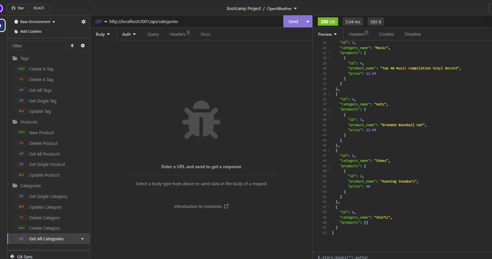
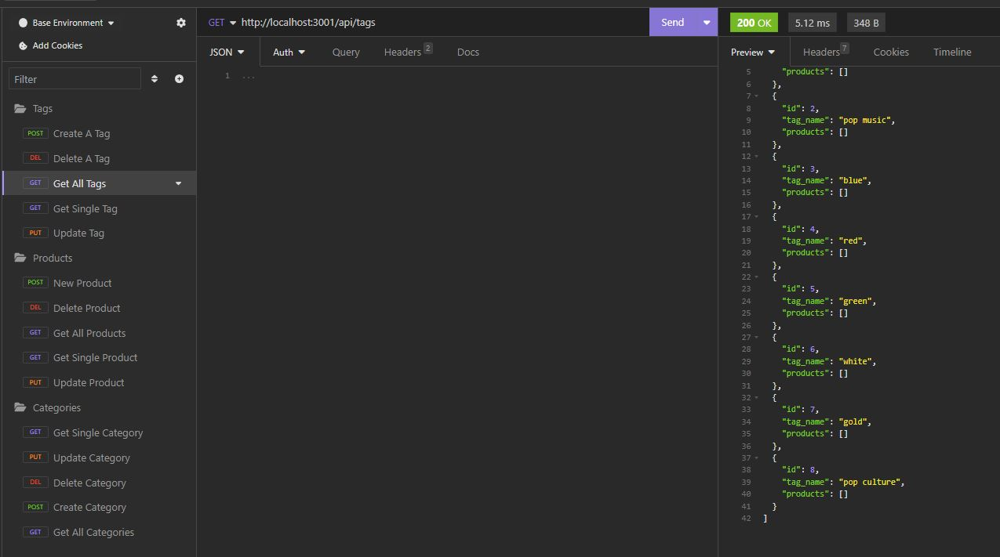
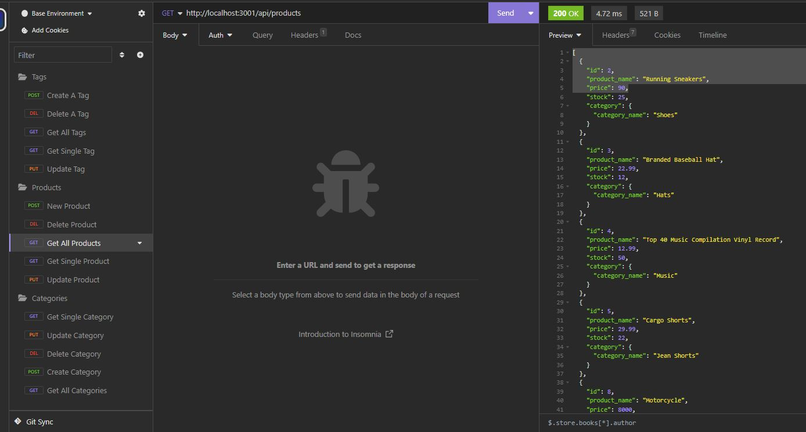

# JavaScript Quiz

An example of the backend database, routes, and APIs might work for an E-Commerce website.

## Authors

- [@ghaworth1](https://www.github.com/ghaworth1)

## Screen Shots

## Links

Repo: https://github.com/ghaworth1/ecommerce/tree/master

Video: https://watch.screencastify.com/v/KKIU6GbVdZvxyYUT9rw4

## License

[MIT](https://choosealicense.com/licenses/mit/)